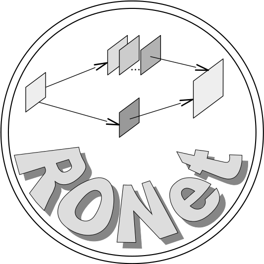

# RONet 
The official implementation of "**Rank-One Network: An Effective Framework for Image Restoration**" via TensorFlow



* [Dependencies](#dependencies)
* [Quick test](#quick-test)
	* [Noise-free image super-resolution](#noise-free-image-super-resolution)
	* [Realistic image super-resolution](#realistic-image-super-resolution)
	* [Gray-scale image denoising](#gray-scale-image-denoising)
	* [Color image denoising](#color-image-denoising)
* [How to train RONet](#how-to-train-ronet)
	* [Pre-train RODec](#pre-train-rodec)
	* [Train RORec](#train-rorec)
* [Citation](#citation)

## Dependencies
We implemented the method on **Ubuntu 16.04** with **Python 3.6**. Before training and test, you need to create an environment via [Anaconda](https://www.anaconda.com/) (suppose it has been installed on your computer), and install **Cuda 8.0** and **CuDNN 7.1.3**, as follows,
```bash
conda create -n RONet python=3.6
source activate RONet
conda install cudnn==7.1.3 # cuda 8.0 would be installed too.
```
Besides, you need to install the following packages using ```pip install -r requirements.txt```
- numpy==1.15.4
- tensorflow==1.10.0
- opencv-python==4.4.0
- tqdm==4.48.2
- scikit-image==0.17.1
- Pillow==7.2.0

Finally, clone our code from the repository and start a quick test:
```bash
git clone https://github.com/shangqigao/RONet.git
cd RONet
```

## Quick test
We tested our models on the widely used benchmark datasets, you can download the collection of them from [BaiduPan](https://pan.baidu.com/s/1EaTwBtMvUA92MXvNCArnDw) (extraction code: 6c1k) or [OneDrive](https://1drv.ms/u/s!AuJaQmQJN4arhAnXt-T7LHoErLwp), and unzip it to the folder ```data/Test```
#### Noise-free image super-resolution
Following [EDSR](https://github.com/shangqigao/EDSR-PyTorch), We test our models with four widely used bechmark datasets :

- [Set5-Bevilacqua et al. BMVC 2012](http://people.rennes.inria.fr/Aline.Roumy/results/SR_BMVC12.html)
- [Set14-Zeyde et al. LNCS 2010](https://sites.google.com/site/romanzeyde/research-interests)
- [B100-Martin et al. ICCV 2001](https://www2.eecs.berkeley.edu/Research/Projects/CS/vision/bsds/)
- [Urban100-Huang et al. CVPR 2015](https://sites.google.com/site/jbhuang0604/publications/struct_sr)

We provided the pre-trained model ```RONet-NF```, please unzip it to the folder ```models```.

|Model|Upscale|Parameters|BaiduPan|OneDrive|
|-----|-------|----------|--------|--------|
|RONet-NF|x4  |5.0M      |[link](https://pan.baidu.com/s/1FxoRxb51lpLluYpNsshrkQ)[0m12]|[link](https://1drv.ms/u/s!AuJaQmQJN4arhALu6f7MyZ5yWg3p)|

Besides, we provided the script ```demo.sh``` for test, please uncomment the following command in ```src/demo.sh```,
```bash
python RONet_test.py --dataset Set5 --input_data_dir ../data/Test/benchmark --task BiSR --upscale 4 --net_type net_sr --depth_RODec 3 --depth_RecROs 3 --depth_RecRes 6 --depth_RecFus 3 --out_channel 3 --RONet_checkpoint ../models/RONet-NF/model --save_dir ../results --GPU_ids 0
```
, and test ```RONet-NF``` on Set5 as follow,
```bash
cd src
sh demo.sh
```

#### Realistic image super-resolution
Following Track2, realistic image SR of NTIRE2018, we used [DIV2K_valid_LR_mild](http://data.vision.ee.ethz.ch/cvl/DIV2K/DIV2K_valid_LR_mild.zip) to test our models. We provided the pre-trained model ```RONet-R```, please unzip it to the folder ```models```.

|Model|Upscale|Parameters|BaiduPan|OneDrive|
|-----|-------|----------|--------|--------|
|RONet-R|x4   |5.0M      |[link](https://pan.baidu.com/s/14nXgdApeh6lYHv9H6mhQ1g) [r5d9]|[link](https://1drv.ms/u/s!AuJaQmQJN4arhAFQlRPf4ZFeWoRp)|

Besides, we provided the script ```demo.sh``` for test, please uncomment the following command in ```src/demo.sh```,
```bash
python RONet_test.py --dataset DIV2K_mild --input_data_dir ../data/Test/benchmark --task ReSR --upscale 4 --net_type net_sr --depth_RODec 3 --depth_RecROs 3 --depth_RecRes 6 --depth_RecFus 3 --out_channel 3 --RONet_checkpoint ../models/RONet-R/model --save_dir ../results --ensemble --GPU_ids 0
```
, and test ```RONet-R``` on DIV2K_valid_LR_mild as follow,
```bash
cd src
sh demo.sh
```
#### Gray-scale image denoising
We tested our models with three widely used datasets:
- [RNI6-Lebrun et al. IPOL 2015]()
- [Set12]()
- [BSD68-Roth et al. CVPR 2005](https://www2.eecs.berkeley.edu/Research/Projects/CS/vision/grouping/resources.html)

We provided the pre-trained model ```RONet-G_sigmaxx```, where ```xx```denotes the noise level, please unzip it to the folder ```models```

|Model|Noise level|Parameters|BaiduPan|OneDrive|
|-----|-------|----------|--------|--------|
|RONet-G_sigma15|15   |2.01M      |[link](https://pan.baidu.com/s/1N6v0csMyC4zf4Cbc909udg)[t4i7]|[link](https://1drv.ms/u/s!AuJaQmQJN4arhAZoKkLv4tqS5BN5)|
|RONet-G_sigma25|25   |2.01M      |[link](https://pan.baidu.com/s/1eINdbdjd3Qix588vEXTTZQ)[l1bf]|[link](https://1drv.ms/u/s!AuJaQmQJN4arhAXX3k9NBkVF2aYG)|
|RONet-G_sigma35|35   |2.01M      |[link](https://pan.baidu.com/s/1MZEgwOeoBgt_ekOI8gTu7w)[iw2w]|[link](https://1drv.ms/u/s!AuJaQmQJN4arhATlEiqN71n1beKY)|
|RONet-G_sigma50|50   |2.01M      |[link](https://pan.baidu.com/s/13xlNW0DXqSVM9Hatf30rWw)[xw55]|[link](https://1drv.ms/u/s!AuJaQmQJN4arhAOcn5QoptVmxmdH)|

Besides, we provided the script ```demo.sh``` for test, please uncomment the following command in ```src/demo.sh```,
```bash
python RONet_test.py --dataset RNI6 --input_data_dir ../data/Test/benchmark --task DEN --net_type net_den --deep_scale 48 --depth_RODec 1 --depth_RecROs 3 --depth_RecRes 6 --depth_RecFus 3 --out_channel 1 --RONet_checkpoint ../logs/RONet-G_sigma50/model --save_dir ../results --sigma 50 --GPU_ids 0
```
, and test ```RONet-G``` on RNI6 with the noise levle of 50, as follow,
```bash
cd src
sh demo.sh
```

#### Color image denoising
We test our models with three widely used datasets:
- [CBSD68-Roth et al. CVPR 2005](https://www2.eecs.berkeley.edu/Research/Projects/CS/vision/grouping/resources.html)
- [Kodak24-Franzen et al. 1999](http://r0k.us/graphics/kodak)
- [McMaster-Zhang et al. 2011](http://www4.comp.polyu.edu.hk/~cslzhang/CDM_Dataset.htm)

We provided the pre-trained model ```RONet-C```, please unzip it to the folder ```models```

|Model|Noise level|Parameters|BaiduPan|OneDrive|
|-----|-------|----------|--------|--------|
|RONet-C|[0, 75]  |2.03M      |[link](https://pan.baidu.com/s/1vthx3oV13dKKibhorI35pA)[45iv]|[link](https://1drv.ms/u/s!AuJaQmQJN4arhAgmCbtwawdnN7Mt)|

Besides, we provided the script ```demo.sh``` for test, please uncomment the following command in ```src/demo.sh```,
```bash
python RONet_test.py --dataset CBSD68 --input_data_dir ../data/Test/benchmark --task DEN --net_type net_den --deep_scale 16 --depth_RODec 1 --depth_RecROs 3 --depth_RecRes 6 --depth_RecFus 3 --out_channel 3 --RONet_checkpoint ../models/RONet-C/model --save_dir ../results --sigma 50 --GPU_ids 0
```
, and test ```RONet-C``` on CBSD68 with the noise levle of 50, as follow,
```bash
cd src
sh demo.sh
```

## How to train RONet
We adopted a two-step strategy to train our RONet, i.e., (1) pretrained the RO decomposition network (RODec), and (2) fixed RODec and trained the RO reconstruction network (RORec). You can download the training datasets from the [official website](https://data.vision.ee.ethz.ch/cvl/DIV2K/), and put them to the folder ```data/Train```.
Besides, please download the checkpoint of VGG19 and put ```vgg_19.ckpt``` to the folder ```models```
#### Pre-train RODec
- Dataset: [DIV2K_train_HR](http://data.vision.ee.ethz.ch/cvl/DIV2K/DIV2K_train_HR.zip)
- Strategy: unsupervised training
- Demo: please uncomment the follow line in the provided script (`src/demo.sh`). 
```bash
nohup python -u RODec_train.py --train_mode unsupervised --out_channel 3 --input_data_dir ../data/Train --augment --log_dir ../logs/UROD-C --GPU_ids 0 >out &
```
Then, please train RODec for color mode following the commands:
```bash
cd scr
sh demo.sh
```
Besides, we provided pre-trained RODec models for grayscale and color images:

|Model|mode   |Strategy  |BaiduPan|OneDrive|
|-----|-------|----------|--------|--------|
|UROD-G|Grayscale|Unsupervised|[link](https://pan.baidu.com/s/1kOXBGcv8DbgpMHZLm5hrrQ)[pa2z]|[link](https://1drv.ms/u/s!AuJaQmQJN4arhACud_fmlyw_OceE)|
|UROD-C|RGB      |Unsupervised|[link](https://pan.baidu.com/s/1lNaFtbbNZ3odbEC8j_YjVQ)[ghp7]|[link](https://1drv.ms/u/s!AuJaQmQJN4arg3-6sPnSha5MN0Es)|

#### Train RORec
- Noise-free image super-resolution
	- Dataset: [DIV2K_train_LR_bicubic_X4](http://data.vision.ee.ethz.ch/cvl/DIV2K/DIV2K_train_LR_bicubic_X4.zip)
	- Strategy: supervised learning
	- Demo: please uncomment the following line in the provided script (`src/demo.sh`). 
```bash
nohup python -u RONet_train.py --input_data_dir ../data/Train --augment --task BiSR --upscale 4 --net_type net_sr --depth_RODec 3 --depth_RecROs 3 --depth_RecRes 6 --depth_RecFus 3 --out_channel 3 --vgg_checkpoint ../models/vgg_19.ckpt --RODec_checkpoint ../models/UROD-C/model --log_dir ../logs/RONet-NF --GPU_ids 0 >out &
```
Then, you can train a RONet-NF model following the commands:
```bash
cd scr
sh demo.sh
```
You can check the logged information via ```vim out```.

- Realistic image super-resolution
	- Dataset: [DIV2K_train_LR_mild](http://data.vision.ee.ethz.ch/cvl/DIV2K/DIV2K_train_LR_mild.zip)
	- Strategy: supervised learning
	- Demo: please uncomment the following lines in the provided script (`src/demo.sh`). 
```bash
nohup python -u RONet_train.py --input_data_dir ../data/Train --augment --task ReSR --upscale 4 --net_type net_sr --depth_RODec 3 --depth_RecROs 3 --depth_RecRes 6 --depth_RecFus 3 --out_channel 3 --vgg_checkpoint ../models/vgg_19.ckpt --RODec_checkpoint ../models/UROD-C/model --log_dir ../logs/RONet-R --GPU_ids 0 >out &
```
Then, you can train a RONet-R model following the commands:
```bash
cd scr
sh demo.sh
```

- Gray-scale image denoising
	- Dataset: [DIV2K_train_HR](http://data.vision.ee.ethz.ch/cvl/DIV2K/DIV2K_train_HR.zip) 
	- Strategy: supervised learning
	- Demo: please uncomment the following line in the provided script (`src/demo.sh`). 
```bash
nohup python -u RONet_train.py --input_data_dir ../data/Train --augment --task DEN --net_type net_den --deep_scale 48 --depth_RODec 1 --depth_RecROs 3 --depth_RecRes 6 --depth_RecFus 3 --out_channel 1 --RODec_checkpoint ../models/UROD-G/model --sigma 50 --log_dir ../logs/RONet-G_sigma50 --GPU_ids 0 >out &
```
Then, you can train a RODec-G model for the noise level of 50 following the commands:
```bash
cd scr
sh demo.sh
```

- Color image denoising
	- Dataset: [DIV2K_train_HR](http://data.vision.ee.ethz.ch/cvl/DIV2K/DIV2K_train_HR.zip) 
	- Strategy: supervised learning
	- Demo: please uncomment the follow line in the provided script (`src/demo.sh`). 
```bash
nohup python -u RONet_train.py --input_data_dir ../data/Train --augment --task DEN --net_type net_den --deep_scale 16 --depth_RODec 1 --depth_RecROs 3 --depth_RecRes 6 --depth_RecFus 3 --out_channel 3 --sigma 75 --range --RODec_checkpoint ../models/UROD-C/model --log_dir ../models/RONet-C --GPU_ids 0 >out &
```
Then, you can train a RODec-C model for the noise level of 50 following the commands:
```bash
cd scr
sh demo.sh
```

## Citation
If our work is useful in your research or publication, please cite the work:

[1] Shangqi Gao, and Xiahai Zhuang, "**Rank-One Network: An Effective Framework for Image Restoration**", submitted to TPAMI, 2020. [[arXiv]](https://arxiv.org/abs/2011.12610)
```
@Article{ronet/tpami/2020,
	title={Rank-One Network: An Effective Framework for Image Restoration},
	author={S. {Gao} and X. {Zhuang}},
    journal={IEEE Transactions on Pattern Analysis and Machine Intelligence},
    doi={xxx},
    number=xxx,
    volumn=xxx,
    year=2020,
    pages={xx--xx}  
}
```

Please contact us via [shangqigao@gmail.com]() or [zxh@fudan.edu.cn](), if you have any questions.
